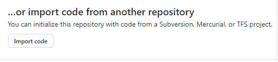
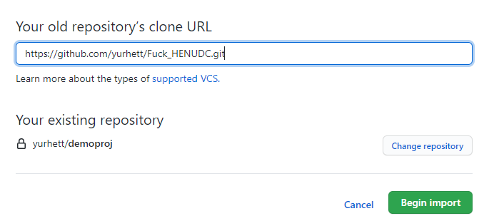

# 克隆源码方法

### 1.打开GitHub首页，选择左上角的"New"来新建项目

### 

### 2.输入您的"Repository name"（您可以随便起名）并选择"Private"

### 

### 3.新建项目后，选择"Import code"

### 

### 4.然后填入"Your old repository’s clone URL"为"https://github.com/yurhett/Fuck_HENUDC.git"，并"Begin import"

